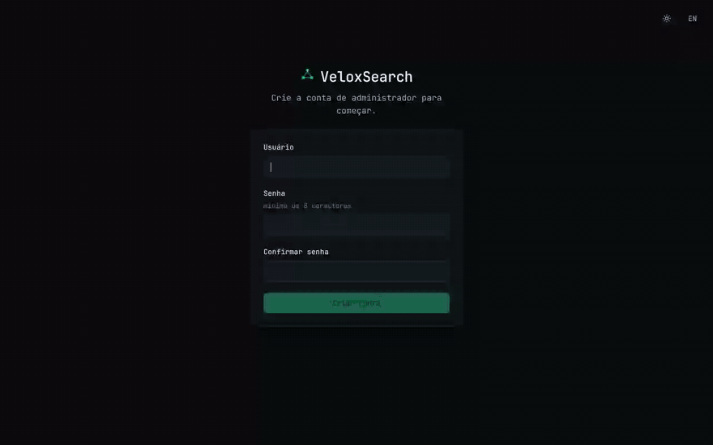

<div align="center">


# VeloxSearch

**Turns a bare Kubernetes cluster into a managed OpenSearch platform.**

A Rust control plane and React UI that install OpenSearch, keep it running,
and give you a wizard instead of a folder of YAML.

[](https://github.com/tornis-tecnologia/veloxsearch-oss/actions/workflows/ci.yml)
[](LICENSE)
[](https://hub.docker.com/r/tornistecnologia/veloxsearch-oss)
[](Cargo.toml)
[](docs/REQUIREMENTS.md)
[](CONTRIBUTING.md)

*Leia em português: [README.pt-BR.md](README.pt-BR.md) · Leer en español: [README.es.md](README.es.md)*

</div>



*First run to first cluster: setup → conformity → deployments → integrations →
the create wizard (held at review — nothing is provisioned in this recording).*

---

You point it at a cluster, open a browser, and it does the rest: checks the
cluster is capable, installs what is missing (Longhorn, cert-manager, the
OpenSearch operator), provisions a deployment sized from presets, wires up log
collection, and then handles the day-2 work — version upgrades, snapshots,
credential rotation, per-tenant isolation.

---

## Is this for you?

**It probably fits if…**

- you want OpenSearch on your own Kubernetes, not a hosted search service
- you would rather click through a wizard than maintain operator CRs, ISM
  policies, index templates and Fluent Bit configs by hand
- you are running k3s / k0s / kubeadm / minikube on hardware you control
- you want log collection for common services (nginx, postgres, kafka,
  Kubernetes events, …) without writing the pipelines
- multi-tenancy matters: each deployment gets its own namespace, quota,
  NetworkPolicy and ownership checks

**It probably does not fit if…**

- you need a managed cloud service — this installs into *your* cluster
- your cluster is **brownfield**: an existing OpenSearch operator, or a
  cert-manager older than 1.16, is out of scope for v1 and the installer will
  refuse rather than fight it
- you are on **arm64**, Kubernetes **< 1.30**, OpenShift, or Windows nodes
- you need to choose your own StorageClass — deployments are pinned to
  Longhorn on purpose (see below)
- you need air-gapped installs — the bootstrap pulls images from docker.io,
  quay.io and cr.fluentbit.io

Read [`docs/REQUIREMENTS.md`](docs/REQUIREMENTS.md) before anything else, and
[`docs/adr/README.md`](docs/adr/README.md) if you want to know whether the
narrowness is principled or accidental. The first is
the honest contract: eight numbered requirements, what each probe checks, and
exactly what the app says when your cluster fails one. A cluster outside the
envelope gets a clear refusal at the conformity screen — never a half-install.

---

## What you actually get

| | |
|---|---|
| **Guided provisioning** | 4-step wizard: purpose → size → backup → review. Sizing presets come from the backend, not a text box |
| **Self-bootstrap** | Installs cert-manager, the OpenSearch operator and Longhorn itself, then **revokes its own cluster-admin binding** when done |
| **Day-2 operations** | Version upgrades (one node at a time, waits green between each; refuses downgrades because the operator cannot roll back), S3 snapshot repositories and schedules, admin-password rotation |
| **Log integrations** | One-click recipes for nginx, postgres, redis, mysql, traefik, mongo, rabbitmq, kafka, plus Kubernetes cluster/pod logs and audit logs. Ingest pipeline, index template, ISM retention policy and the collection agent, together |
| **Observability stack** | Optional OpenTelemetry stack per deployment — collector, Data Prepper, Cortex, Alertmanager — feeding the Observability screens |
| **Multi-tenancy** | Per-tenant namespace, ResourceQuota, LimitRange and NetworkPolicy; every API route is ownership-checked, and an unowned name reads as "does not exist" |
| **Honest status** | Activity screens explain a stalled operation with facts from the cluster — which shard, which node, how long — instead of a spinner |

---

## Requirements, in one breath

Kubernetes **≥ 1.30**, **amd64**, **≥ 8 GiB** allocatable RAM and **2 vCPU**
free (12 GiB / 4 vCPU / 60 GB recommended for a comfortable single node),
outbound registry egress, cluster-admin **at install time only**, and no
OpenSearch operator already running.

Storage is deliberately narrow: **Longhorn is the only supported deployment
storage.** If it is absent VeloxSearch installs it. Node-local provisioners
(`local-path`, hostpath) are refused because a rescheduled OpenSearch pod loses
its data on them — a foreign CSI default is not silently accepted either. If a
node is missing `open-iscsi`, an NFS client or `dmsetup`, the UI names the node
and gives you the install command for its distro.

Full table with probes and failure messages: [`docs/REQUIREMENTS.md`](docs/REQUIREMENTS.md).

---

## Try it

```bash
kubectl apply -f https://github.com/tornis-tecnologia/veloxsearch-oss/releases/latest/download/install.yaml
kubectl -n veloxsearch-system port-forward svc/veloxsearch 3000:80
# open http://localhost:3000 — create the admin account, and the app takes over
```

That URL is a **release artifact**, not a branch: the image in it is pinned to a
digest, so what you apply today is what you get if you apply it again next
month. `releases/latest/` follows the newest release; pin a version with
`releases/download/v0.7.1/install.yaml`. Applying `deploy/install.yaml` from
`main` instead gives you whatever is on HEAD at that moment — fine for
development, wrong for a cluster you care about.

One file, no registry credentials — the image is
[`tornistecnologia/veloxsearch-oss`](https://hub.docker.com/r/tornistecnologia/veloxsearch-oss),
public and pulled anonymously —
no `velox init` pre-step. On a cluster with a default IngressClass — a fresh k3s,
say — a catch-all Ingress is also created, so it answers on `http://<node-ip>/`
with no port-forward at all.

What happens next is automatic: the conformity screen checks the eight
requirements, then installs cert-manager and the operator without asking.
Longhorn arrives when you create your first deployment. The one thing that can
stop you is a node missing Longhorn's packages, and the UI tells you which
command to run.

Per-platform walkthroughs — minikube, k0s, k3s, kubeadm — plus air-gapped
side-loading and the teardown path: [`docs/INSTALL.md`](docs/INSTALL.md).

---

## How it works

```
      browser
         │
    ┌────▼─────────────────────────┐
    │  veloxsearch (single binary) │   Rust · Axum · kube-rs
    │  React SPA served from /     │   one Deployment, one Service
    └────┬─────────────────────────┘
         │  Kubernetes API (scoped RBAC, ownership-checked)
    ┌────▼──────────────┬──────────────────┬──────────────────┐
    │ OpenSearch        │ cert-manager     │ Longhorn         │
    │ operator          │ (webhook certs)  │ (deployment PVCs)│
    └────┬──────────────┴──────────────────┴──────────────────┘
         │  OpenSearchCluster CRs
    ┌────▼───────────────────────────────────────────────────┐
    │ per-deployment: OpenSearch nodes + Dashboards          │
    │ + collection agents in the tenant's namespace          │
    └────────────────────────────────────────────────────────┘
```

The control plane is one binary with the SPA embedded — no separate frontend to
deploy. It talks to the Kubernetes API and to each deployment's OpenSearch and
Dashboards HTTP APIs. Deployment state lives in the `OpenSearchCluster` CR, not
in a database, so the cluster remains the source of truth.

The three self-managing behaviours — when Longhorn is installed, how bootstrap
is gated, and the namespace model — are specified in
[`docs/PREMISES.md`](docs/PREMISES.md), with each claim cited to `file:line`.

---

## Documentation

| | |
|---|---|
| [`docs/REQUIREMENTS.md`](docs/REQUIREMENTS.md) | The platform contract: R1–R8, probes, refusal messages, tested platforms. **Start here.** |
| [`docs/INSTALL.md`](docs/INSTALL.md) | Per-platform install, access modes, teardown |
| [`docs/ARCHITECTURE.md`](docs/ARCHITECTURE.md) | How the control plane is put together, and the two conventions that are load-bearing |
| [`docs/DEVELOPMENT.md`](docs/DEVELOPMENT.md) | The local loop, and how to run the tests that need Postgres or a registry checkout |
| [`docs/DEPLOY.md`](docs/DEPLOY.md) | Building and publishing a release; air-gapped side-loading |
| [`docs/SECRETS.md`](docs/SECRETS.md) | Every secret the control plane reads or creates, and how to rotate it |
| [`docs/PREMISES.md`](docs/PREMISES.md) | The self-managing behaviours and the permissions each needs |
| [`docs/ROADMAP.md`](docs/ROADMAP.md) | What is planned, what is open, and what is deliberately not being done |
| [`docs/adr/README.md`](docs/adr/README.md) | What each of the ADR numbers cited throughout the source decided |
| [`docs/integrations/`](docs/integrations/) | Integration-package format: manifest schema, interpolation, signing |
| `tests/*_check.py` | Executable acceptance checks — smoke, first-run, day-2, full journey, and a Playwright browser gate |

Layout: `src/` control plane and the `velox` CLI · `frontend/` React SPA ·
`deploy/` install manifest, Dockerfile, bootstrap bundles, tenant templates ·
`migrations/` schema.

---

## Maturity

Running in production for its author, and deliberately narrow rather than
broadly compatible: the requirements envelope is kept small so everything inside
it works, instead of degrading in interesting ways outside it.

The conformance fleet was re-verified against v0.8.0 on 2026-08-25 (see
[`docs/REQUIREMENTS.md`](docs/REQUIREMENTS.md) for the per-row evidence): the
install → conformity → refusal paths are verified live on k3s, k0s and a real
3-node Longhorn cluster, and a trunk CI lane boots the released image on
minikube on every push. Two known gaps are tracked rather than hidden:
single-node deployments stall on Longhorn's default replica count
([#26](https://github.com/tornis-tecnologia/veloxsearch-oss/issues/26)), and
the post-green rolling restart can hang on system-index shard recovery
([#27](https://github.com/tornis-tecnologia/veloxsearch-oss/issues/27)). The
OpenTelemetry observability stack ships but has had limited real-world
exercise.

---

## Contributing

Contributions are welcome. Start with [`CONTRIBUTING.md`](CONTRIBUTING.md) — it
covers the local setup, the DCO sign-off every commit needs, and the two
conventions this codebase holds to that are not obvious from the outside:
ownership is enforced by the type system rather than by checks, and the modules
that decide things deliberately make no cluster calls.

Three places to start that need no Rust:

- Issues labelled [`good first issue`](https://github.com/tornis-tecnologia/veloxsearch-oss/labels/good%20first%20issue)
- **New log integrations** — an integration is a signed *data* package, not
  code. They live in
  [`veloxsearch-registry`](https://github.com/tornis-tecnologia/veloxsearch-registry)
- **Translations** — every UI string is in `frontend/i18n.jsx`

Please read [`CODE_OF_CONDUCT.md`](CODE_OF_CONDUCT.md) before participating, and
[`SECURITY.md`](SECURITY.md) before reporting anything security-relevant —
vulnerabilities go through private advisories, never public issues.

## License

**GNU Affero General Public License v3.0 only** (`AGPL-3.0-only`). Full text in
[LICENSE](LICENSE); every source file carries the SPDX header, and `Cargo.toml`
declares the same.

What it means in practice:

- **Running it is free** — internally or commercially, at no cost.
- **Modifying it is allowed.**
- **Section 13 is the one to read.** If you make VeloxSearch available to other
  users *over a network* — including a modified version — you must offer those
  users the complete corresponding source of the version they are interacting
  with, under this same license. For a tool whose whole purpose is to be a web
  UI other people use, that clause is the point, not a footnote.

Dependencies are AGPL-compatible: MIT, Apache-2.0, BSD, ISC, Zlib, Unicode-3.0
and CDLA-Permissive-2.0 on the Rust side; MIT, Apache-2.0, BSD-3-Clause, 0BSD,
ISC and MPL-2.0 on the frontend, with MPL only in build-time tooling. No
GPL-2.0-only, SSPL, BUSL or non-commercial code is linked in. Re-check it
yourself:

```bash
cargo install cargo-deny && cargo deny check licenses
```

Inbound contributions are accepted under the same licence, certified by a
[DCO](https://developercertificate.org/) sign-off on each commit rather than a
CLA. See [`CONTRIBUTING.md`](CONTRIBUTING.md).
