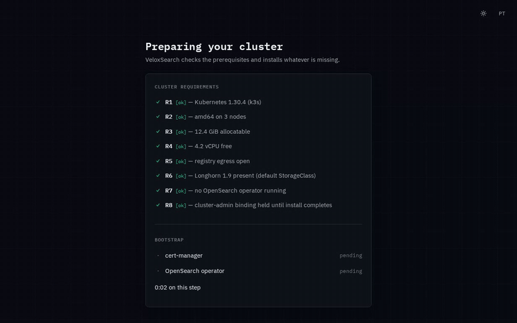
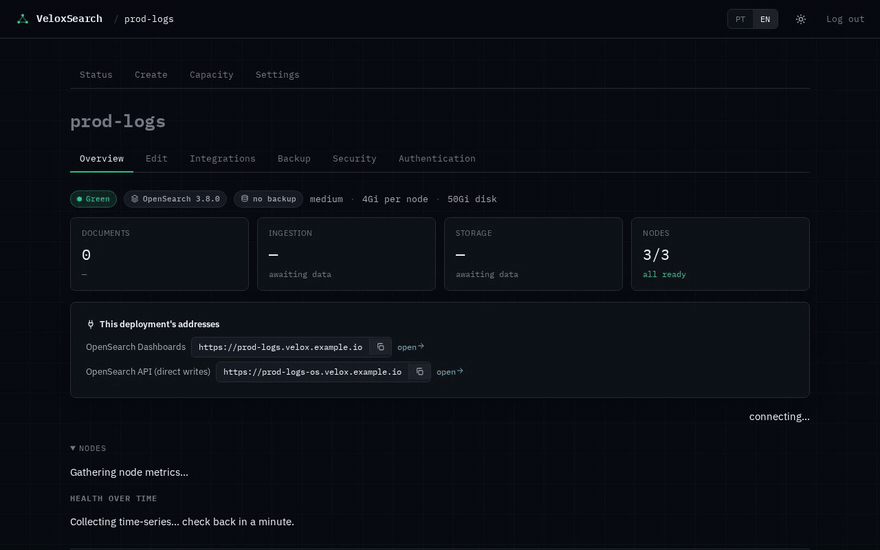
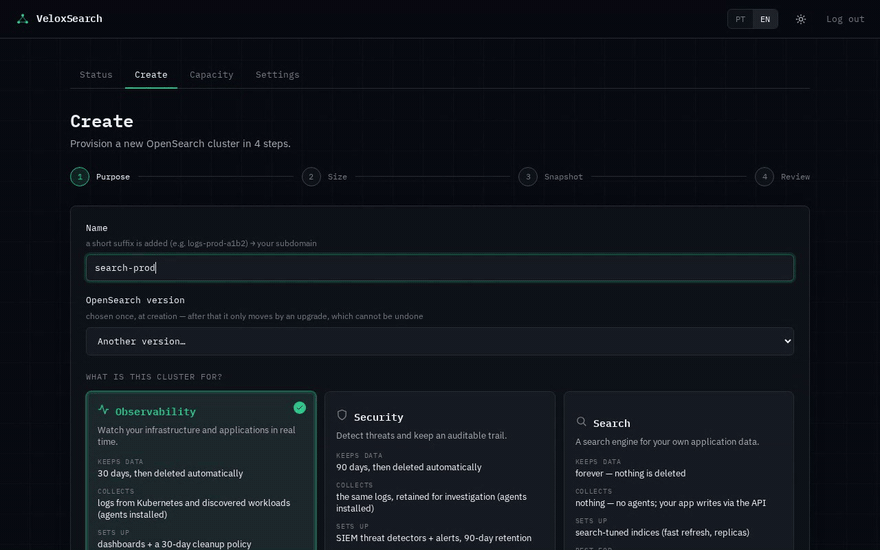
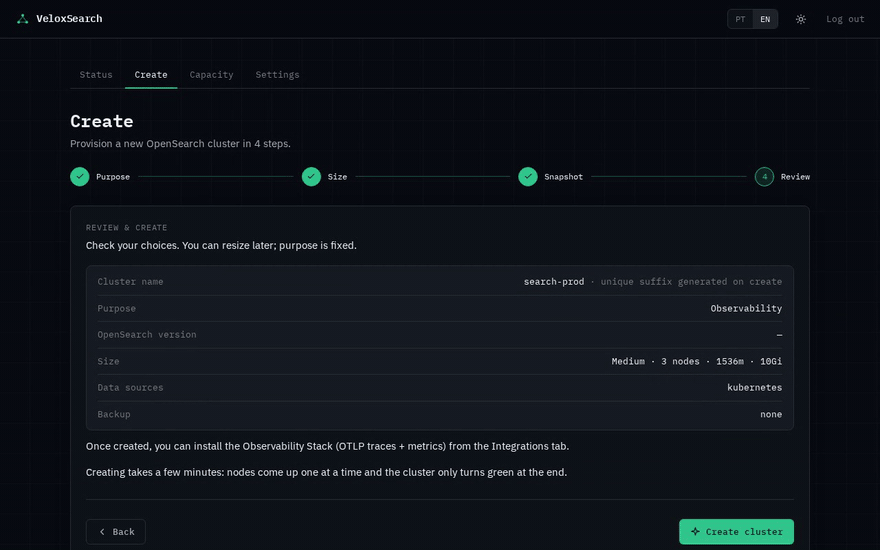

<div align="center">


# VeloxSearch

**Turns a bare Kubernetes cluster into a managed OpenSearch platform.**

[](https://github.com/tornis-tecnologia/veloxsearch-oss/actions/workflows/ci.yml)
[](LICENSE)
[](https://hub.docker.com/r/tornistecnologia/veloxsearch-oss)
[](Cargo.toml)
[](docs/REQUIREMENTS.md)
[](CONTRIBUTING.md)

*Leia em português: [README.pt-BR.md](README.pt-BR.md) · Leer en español: [README.es.md](README.es.md)*

</div>

VeloxSearch is a control plane and web UI that runs inside your own Kubernetes
cluster. You point it at the cluster and open a browser: it checks the cluster
is capable, installs what is missing (cert-manager, the OpenSearch operator,
Longhorn), creates OpenSearch deployments from a four-step wizard, wires up log
collection, and then handles the day-2 work — version upgrades, snapshots,
credential rotation.

**Open source under the [GNU AGPL-3.0-only](LICENSE).** Self-hosting it — for
your team or your company, commercially included — is free and needs nothing
from us. The one obligation: if you modify VeloxSearch and let other people use
your version over a network, you must offer them its source. [Details below](#license).

## Install

```bash
kubectl apply -f https://github.com/tornis-tecnologia/veloxsearch-oss/releases/latest/download/install.yaml
```

Then `kubectl -n veloxsearch-system port-forward svc/veloxsearch 3000:80`, open
<http://localhost:3000> and create the admin account — the app takes it from
there. On a cluster with a default IngressClass (a fresh k3s, say) it also
answers on `http://<node-ip>/`, no port-forward needed.

> **Starting from zero, without a Kubernetes cluster?** Follow
> [`docs/INSTALL.md`](docs/INSTALL.md#0-no-kubernetes-cluster-yet) — from a bare
> Linux machine or a laptop to a running UI — or the
> [user guide on the site](https://get.veloxsearch.ai/docs/en).

## Screens

<table>
  <tr>
    <td width="50%"><a href=".github/assets/screens/conformity.png"></a></td>
    <td width="50%"><a href=".github/assets/screens/deployment-overview.png"></a></td>
  </tr>
  <tr>
    <td align="center"><sub>The cluster is checked before anything is installed</sub></td>
    <td align="center"><sub>A green deployment and its addresses</sub></td>
  </tr>
  <tr>
    <td width="50%"><a href=".github/assets/screens/create-purpose.png"></a></td>
    <td width="50%"><a href=".github/assets/screens/create-review.png"></a></td>
  </tr>
  <tr>
    <td align="center"><sub>Create, step 1: the purpose sets retention and defaults</sub></td>
    <td align="center"><sub>Create, step 4: review before anything is provisioned</sub></td>
  </tr>
</table>

## Why VeloxSearch

- **A wizard instead of a folder of YAML.** Purpose → size → snapshot → review.
  Sizing presets come from the backend; the purpose you pick sets retention,
  detectors and index defaults for you.
- **It checks before it touches.** Eight numbered requirements are probed up
  front. A cluster outside the envelope gets a clear refusal naming what failed —
  never a half-install.
- **It installs its own prerequisites, then gives the keys back.** cert-manager,
  the OpenSearch operator and Longhorn arrive on their own, and the app
  **revokes its own cluster-admin binding** when it is done.
- **Logs flowing without writing pipelines.** One-click integrations for nginx,
  postgres, redis, mysql, traefik, mongo, rabbitmq, kafka and Kubernetes ship the
  ingest pipeline, index template, retention policy and collection agent together.
- **Day-2 is built in.** Version upgrades one node at a time (waiting for green
  between each, refusing downgrades the operator cannot undo), S3 snapshot
  schedules, admin-password rotation, and an optional OpenTelemetry stack.
- **Status that explains itself.** A stalled operation is explained with facts
  from the cluster — which shard, which node, how long — instead of a spinner.
- **Your cluster, your data.** Nothing runs outside your infrastructure, and the
  deployment state lives in Kubernetes objects you can inspect with `kubectl`.

**Where it is going:** [`docs/ROADMAP.md`](docs/ROADMAP.md) lists what is being
worked on now, what is next, and what is deliberately not planned.

**Want to see it on your own cluster?** [Request a demo](https://get.veloxsearch.ai/en#demo).

---

## Is this for you?

**It probably fits if…**

- you want OpenSearch on your own Kubernetes, not a hosted search service
- you are running k3s / k0s / kubeadm / minikube on hardware you control
- you would rather click through a wizard than maintain operator CRs, ISM
  policies, index templates and Fluent Bit configs by hand

**It probably does not fit if…**

- you need a managed cloud service — this installs into *your* cluster
- your cluster is **brownfield**: an existing OpenSearch operator, or a
  cert-manager older than 1.16, is out of scope for v1 and the installer will
  refuse rather than fight it
- you are on **arm64**, Kubernetes **< 1.30**, OpenShift, or Windows nodes
- you need to choose your own StorageClass — deployments are pinned to
  Longhorn on purpose
- you need air-gapped installs — the bootstrap pulls images from docker.io,
  quay.io and cr.fluentbit.io

**Requirements, in one breath:** Kubernetes **≥ 1.30**, **amd64**, **≥ 8 GiB**
allocatable RAM and **2 vCPU** free (12 GiB / 4 vCPU / 60 GB recommended for a
comfortable single node), outbound registry egress, cluster-admin **at install
time only**, and no OpenSearch operator already running. Longhorn is the only
supported deployment storage; if a node lacks its packages, the UI names the
node and gives you the command. The full contract — each requirement, its probe
and its refusal message — is [`docs/REQUIREMENTS.md`](docs/REQUIREMENTS.md).

---

## How it works

```
      browser
         │
    ┌────▼─────────────────────────┐
    │  veloxsearch (single binary) │   Rust · Axum · kube-rs
    │  React SPA served from /     │   one Deployment, one Service
    └────┬─────────────────────────┘
         │  Kubernetes API (scoped RBAC, ownership-checked)
    ┌────▼──────────────┬──────────────────┬──────────────────┐
    │ OpenSearch        │ cert-manager     │ Longhorn         │
    │ operator          │ (webhook certs)  │ (deployment PVCs)│
    └────┬──────────────┴──────────────────┴──────────────────┘
         │  OpenSearchCluster CRs
    ┌────▼───────────────────────────────────────────────────┐
    │ per-deployment: OpenSearch nodes + Dashboards          │
    │ + collection agents in the tenant's namespace          │
    └────────────────────────────────────────────────────────┘
```

The control plane is one binary with the SPA embedded. It talks to the
Kubernetes API and to each deployment's OpenSearch and Dashboards HTTP APIs.
Deployment state lives in the `OpenSearchCluster` CR, not in a database, so the
cluster remains the source of truth. The self-managing behaviours and the
permissions each needs are in [`docs/PREMISES.md`](docs/PREMISES.md); the
internals in [`docs/ARCHITECTURE.md`](docs/ARCHITECTURE.md).

---

## Documentation

| | |
|---|---|
| [`docs/INSTALL.md`](docs/INSTALL.md) | From zero to a running UI: per-platform install, private mirrors, side-loading, first run, your own domain and TLS |
| [`docs/REQUIREMENTS.md`](docs/REQUIREMENTS.md) | The platform contract: R1–R8, probes, refusal messages, tested platforms |
| [`docs/ARCHITECTURE.md`](docs/ARCHITECTURE.md) | How the control plane is put together, and the two conventions that are load-bearing |
| [`docs/DEVELOPMENT.md`](docs/DEVELOPMENT.md) | The local loop, and how to run the tests that need Postgres or a registry checkout |
| [`docs/DEPLOY.md`](docs/DEPLOY.md) | Building and publishing a release; air-gapped side-loading |
| [`docs/INSTALLER.md`](docs/INSTALLER.md) | The `velox` CLI, for installs from a private mirror |
| [`docs/SECRETS.md`](docs/SECRETS.md) | Every secret the control plane reads or creates, and how to rotate it |
| [`docs/PREMISES.md`](docs/PREMISES.md) | The self-managing behaviours and the permissions each needs |
| [`docs/ROADMAP.md`](docs/ROADMAP.md) | What is planned, what is open, and what is deliberately not being done |
| [`docs/adr/README.md`](docs/adr/README.md) | What each of the ADR numbers cited throughout the source decided |
| [`docs/integrations/`](docs/integrations/) | Integration-package format: manifest schema, interpolation, signing |
| [`CHANGELOG.md`](CHANGELOG.md) | What changed in each release |

Layout: `src/` control plane and the `velox` CLI · `frontend/` React SPA ·
`deploy/` install manifest, Dockerfile, bootstrap bundles, tenant templates ·
`migrations/` schema · `tests/*_check.py` executable acceptance checks.

---

## Maturity

Running in production for its author, and deliberately narrow rather than
broadly compatible: the requirements envelope is kept small so everything inside
it works, instead of degrading in interesting ways outside it.

The last recorded conformance fleet run was against v0.8.0 on 2026-08-25 (per-row
evidence in [`docs/REQUIREMENTS.md`](docs/REQUIREMENTS.md)): install → conformity
→ refusal verified live on k3s, k0s and a real 3-node Longhorn cluster. The two
gaps it found — single-node deployments stalling on Longhorn's replica count
([#26](https://github.com/tornis-tecnologia/veloxsearch-oss/issues/26)) and the
post-green rolling restart hanging on shard recovery
([#27](https://github.com/tornis-tecnologia/veloxsearch-oss/issues/27)) — were
fixed in 0.8.1. A trunk CI lane boots the latest released image on minikube on
every push. Multi-tenancy is complete enough to run but off by default, and the
OpenTelemetry observability stack ships but has had limited real-world exercise.

---

## Contributing

Contributions are welcome. Start with [`CONTRIBUTING.md`](CONTRIBUTING.md) — it
covers the local setup, the DCO sign-off every commit needs, and the two
conventions this codebase holds to that are not obvious from the outside:
ownership is enforced by the type system rather than by checks, and the modules
that decide things deliberately make no cluster calls.

Three places to start that need no Rust:

- Issues labelled [`good first issue`](https://github.com/tornis-tecnologia/veloxsearch-oss/labels/good%20first%20issue)
- **New log integrations** — an integration is a signed *data* package, not
  code. They live in
  [`veloxsearch-registry`](https://github.com/tornis-tecnologia/veloxsearch-registry)
- **Translations** — every UI string is in `frontend/i18n.jsx`

Please read [`CODE_OF_CONDUCT.md`](CODE_OF_CONDUCT.md) before participating, and
[`SECURITY.md`](SECURITY.md) before reporting anything security-relevant —
vulnerabilities go through private advisories, never public issues.

## License

**GNU Affero General Public License v3.0 only** (`AGPL-3.0-only`). Full text in
[LICENSE](LICENSE); every source file carries the SPDX header, and `Cargo.toml`
declares the same.

What it means in practice:

- **Running it is free** — internally or commercially, at no cost.
- **Modifying it is allowed.**
- **Section 13 is the one to read.** If you make VeloxSearch available to other
  users *over a network* — including a modified version — you must offer those
  users the complete corresponding source of the version they are interacting
  with, under this same license. For a tool whose whole purpose is to be a web
  UI other people use, that clause is the point, not a footnote.

Dependencies are AGPL-compatible: MIT, Apache-2.0, BSD, ISC, Zlib, Unicode-3.0
and CDLA-Permissive-2.0 on the Rust side; MIT, Apache-2.0, BSD-3-Clause, 0BSD,
ISC and MPL-2.0 on the frontend, with MPL only in build-time tooling. No
GPL-2.0-only, SSPL, BUSL or non-commercial code is linked in. Re-check it
yourself:

```bash
cargo install cargo-deny && cargo deny check licenses
```

Inbound contributions are accepted under the same licence, certified by a
[DCO](https://developercertificate.org/) sign-off on each commit rather than a
CLA. See [`CONTRIBUTING.md`](CONTRIBUTING.md).
